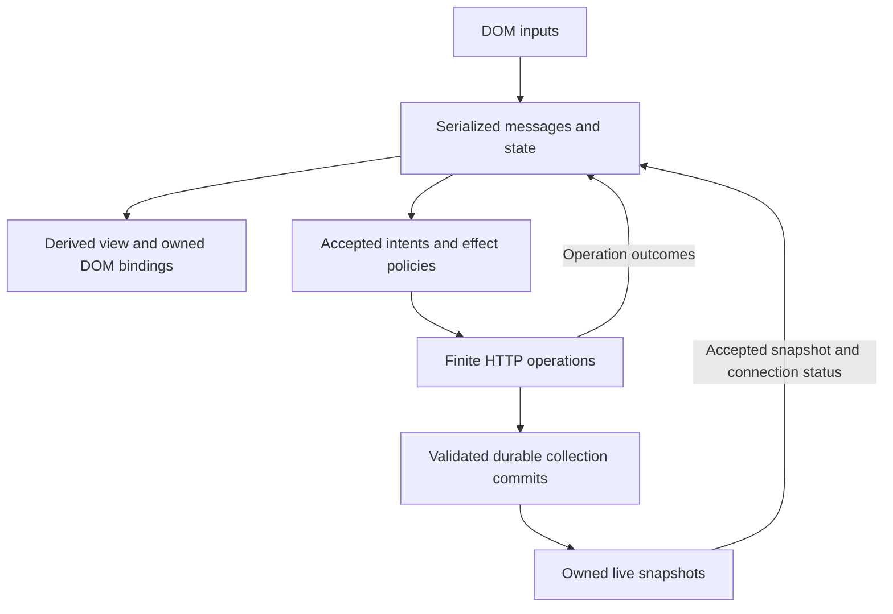

# M09 — Application graph and source API

Revision: **rxjs-flow migration r2 — Cloudflare/Hono**. Inspected starting commit:
`5362f0392b73c8cd7b8f8fb53e0857b257e55eb3` (M08, merged PR #15).
M09 is implemented and locally verified; acceptance review/merge remains pending.
Its final verification belongs in the [acceptance record](acceptance.md).
This guide describes the implemented app.

The browser remembers UI state and the latest accepted server snapshot. Named
domain functions interpret inputs, reduce state and select view values. RxJS 7
connects those values over time and applies explicit execution policies. The
Durable Object's persisted collection is the authority for saved Todos.

## The application graph



`todo.program.ts` connects the graph. `todo.state.ts` and `todo.selectors.ts`
contain pure state/view logic; `todo.intents.ts` interprets a complete transition
into an intent. `todo.effects.ts` supplies admission and execution policy.
`todo.view.tsx` binds a stable shell and keyed rows. A render changes DOM only;
it never starts an HTTP write. Pure functions remain ordinary functions where
no sequence or lifetime is needed.

The graph has two distinct kinds of server feedback. A finite mutation reply
settles the pending operation and its captured draft. An accepted live snapshot
replaces collection content. The reply does not append the same Todo a second
time. Local filters derive visible rows; they neither fetch nor change the saved
collection. Each mounted app owns its draft, filter and pending operations.

## Activation, temperature and sharing

| Boundary | Construction and activation | Sharing and disposal |
|---|---|---|
| `domEvent$` | An inert description; subscribing attaches one listener to an independently hot browser EventTarget. Events can occur before subscription and are not replayed. | Two subscriptions attach two listeners. Disposal removes the exact owned listener; it does not stop the browser's event producer. |
| Finite HTTP methods | Calling a method creates a cold description. Each subscription invokes its own fetch and body reader. | A second subscription repeats the request. Unsubscription aborts supported transport/body work and ignores late results. |
| `todoEffects$` | A cold effect graph with fresh operation IDs and admission state per subscription. | The mounted root subscribes once. Additional consumers observe model streams, not this execution source. Disposal cancels local requests and drops waiting writes. |
| Program `state$` | Observing before `start()` does not initialize state. `start()` owns one `scan` accumulation and publishes the initial state. | A private `ReplaySubject(1)` distributes current state; root ownership survives a gap with no consumers. Disposal replaces the replay holder and completes observers, releasing remembered state. |
| `transitions$` / `viewModel$` | Transitions carry the exact input, previous state and next state. View values are pure projections of the shared state. | Transitions are not replayed. Each view subscriber may repeat the pure projection; it never repeats reduction or effects. |
| `liveConnection$` | Cold: each subscription owns its own EventSource attempts, deadline and recovery cycle. | The app subscribes once and distributes accepted results through state. Disposal closes the connection and cancels retry/deadline/recovery work. |
| Authority `execute$(command)` | Creates a lazy operation handle. Its first subscriber admits the command to the collection queue. | Subscribers to that same handle share its retained result. Separate calls describe separate operations. Once admitted, the authority owns settlement even if all reply observers leave. |
| Authority `watch$()` | Each subscription admits a bounded registration; initial committed read and live attachment occur in one serialized queue turn. | Registered consumers observe the same collection history. Cancel removes that consumer; it never deletes stored state or cancels another consumer. |

The implementation deliberately uses root-owned `scan` plus private replay,
rather than relying on `shareReplay` defaults to infer application lifetime.
Selectors use `distinctUntilChanged` to suppress equivalent view values. FIFO
ingress prevents synchronous feedback from overtaking the current state and
transition publication. This proves the program's ordering contract, not
glitch freedom for arbitrary RxJS graphs.

`createTodoApp`/`createTodoProgram` constructs without DOM queries, subscriptions,
HTTP or live connections. `start(root)` first checks the shell, connects view and
effect consumers, starts state, then enables live/startup work and DOM inputs.
Synchronous service results therefore reach an already connected model/view.
Starting twice is a no-op. Disposal first rejects inputs, then releases sources,
view/row scopes, effects and state. A disposed app cannot restart; construct a
new instance. That fresh UI lifetime reconnects to the existing saved collection.

`src/client/browser.ts` is the deliberate executable exception: importing it
mounts the default app immediately. Import the inert `main.tsx` facade for custom
host assembly. The Node `src/server/main.ts` is likewise an executable entry.

## Time and execution policies

| New value / situation | Implemented policy | Observable consequence |
|---|---|---|
| Finite compatibility-mode read | `switchMap`: latest read replaces the previous one. | Old local request/body work is cancelled; stale success cannot replace current state. The normal live host does not use this GET loop. |
| Accepted create/update/delete | One `concatMap` FIFO; default 32 active plus waiting writes. | One local write runs at a time. Overflow emits a visible rejection without starting that write. This is separate from the server's queue. |
| Another create while an accepted create waits or runs | `exhaustMap`: ignore while busy. | Its captured draft remains associated with the admitted create; newer draft edits survive the older reply. |
| Expected finite request failure | Recover at the request capability boundary into a correlated failure message. | The intent graph continues; no automatic mutation retry. Unexpected graph/render faults dispose the app and reach its error reporter. |
| Live transport interruption | Close EventSource, then scheduler-owned retries after 1, 2, 4 and 8 seconds. | One attempt at a time; a validated snapshot resets consecutive failures. Protocol failure or exhaustion waits for manual Reconnect. |
| New manual Reconnect value | `switchMap`: replace the attempt or waiting recovery cycle. | Cancel its transport, deadline and wait, then start a fresh retry budget. |
| No first snapshot | A 10-second deadline per attempt from the injected scheduler. | An open connection alone is not readiness. There is no heartbeat or fixed detection time for a later silent partition. |
| View value | Synchronous scalar/keyed commit; reentrant list commits queue. | No frame scheduler or animation loop; retained keyed rows preserve identity/focus where applicable. |
| Collection operation | Bounded authority admission followed by `concatMap` serialization and atomic storage transition. | Client queues do not order other clients; the collection owner establishes commit order. |

Source clocks and injected schedulers supply time. Operators select, order and
cancel work. Native EventSource reconnect is stopped so it cannot compete with
the RxJS recovery policy. Cancellation is local release, not successful
completion and not proof that an admitted remote write was rolled back.

## Small source API proven by the app

These are repository source imports, not a published package-root API. The
reference app remains one private application; no new release, plugin contract
or multi-package distribution is introduced. Platform adapters and test seams
remain explicit modules rather than a blanket export of every helper.

| Source module | Functions / handle | Contract |
|---|---|---|
| [`src/client/main.tsx`](../../src/client/main.tsx) | `createTodoApp(service?, options?)`; `mountTodoApp(root, options?)` | Construct inertly, or construct and start. Handle exposes `start`, `refresh`, `dispose`, `state$`, `viewModel$`, `transitions$`. `refresh()` means Reconnect in live mode and latest GET in explicit finite mode. |
| [`src/client/todo.service.ts`](../../src/client/todo.service.ts) | `createTodoService(options?)` | Cold `getAll$`, `create$`, `update$`, `remove$`; `live$(recover$)` describes the live owner. Optional fetch, EventSource and scheduler capabilities support isolated hosts/tests. Omitting `live$` on an injected service selects finite compatibility mode. |
| [`src/client/runtime/program.ts`](../../src/client/runtime/program.ts) | `createProgram({initialState, reduce, …})` | `start`, `dispatch`, `dispose`, `closed`, read-only `state$` and `transitions$`. Dispatch before start or after disposal is rejected. |
| [`src/client/runtime/scope.ts`](../../src/client/runtime/scope.ts) | `createScope()` | `add`, `child`, `subscribe`, `dispose`, `closed`. Own the subscriber before synchronous source activation; a disposed child releases its work. |
| [`src/client/runtime/sources.ts`](../../src/client/runtime/sources.ts) | `domEvent$(target, type, capture)` | Capture native values and required `preventDefault()` synchronously, before downstream timing policies. |
| [`src/client/dom/bindings.ts`](../../src/client/dom/bindings.ts), [`keyed-list.ts`](../../src/client/dom/keyed-list.ts) | `bindText`, `bindProperty`, `bindAttribute`, `bindIf`, `bindKeyedList` | Calling a binding subscribes under its supplied scope. Scalar completion retains the last DOM value; list/conditional source completion retains children until their binding lifetime is disposed. |
| [`src/client/api.ts`](../../src/client/api.ts), [`src/shared/routes.ts`](../../src/shared/routes.ts) | `createClient(routes, options?)`; shared `routes` | Infer finite request/response types; runtime-check responses. Live routes are excluded from the finite JSON client. |
| [`src/shared/trace.ts`](../../src/shared/trace.ts) | `createTrace`, `createTraceRecorder` | Optional injected observations and bounded copied records. No extra effect subscription; runtime-local sequence/time, not a global clock or distributed tracing protocol. |

The server keeps `Effect` as an Observable request-to-response function and
`Middleware` as an RxJS request operator. `createTodoRoutes()` supplies one route
registration list to both adapters. `createHonoApp()`/`createWorkerApp()` register
routes inertly; the Fetch host activates the matching request. `createTodoAuthority()`
receives storage and clock/identity capabilities; the thin `TodoCollection`
platform entry supplies them. Hono contexts and Durable Object stubs stay outside
reducers and browser modules. These adapter factories are source-level assembly
points, not a new universal hosting API.

## HTTP, validation and ownership

The Worker public API retains `/api`; its Hono adapter maps that prefix once to
the shared unprefixed contracts. The retained Node server exposes the unprefixed
paths directly; its Vite development proxy strips `/api`. Finite results below
are the success contract, subject to validation and access policy.

| Worker request | Success | Purpose |
|---|---|---|
| `GET /api/todos?completed=true` (query optional, `true` or `false`) | `200`, Todo array | Explicit finite collection read. |
| `POST /api/todos`, `{title}` | `201`, Todo | Create one Todo. |
| `PUT /api/todos/:id`, `{title?, completed?}` | `200`, Todo | Update the selected Todo. |
| `DELETE /api/todos/:id` | `204`, empty body | Delete the selected Todo. |
| `GET /api/todos/live` | SSE `todo-snapshot` | Versioned full committed snapshot for the reference app. |
| `GET /api/todos/stream` | SSE `todos` | Retained legacy bare-array protocol. |

A Todo is `{id, title, completed, createdAt}`. `createdAt` is an ISO timestamp;
its UTC representation does not locate the server. The live envelope is
`{schemaVersion: 1, collectionId, stateGeneration, revision, todos}`. Finite
client decoding checks status, JSON schema and the DELETE empty-body contract;
invalid responses and non-2xx statuses cannot enter its success channel.

Both HTTP adapters bound incoming bodies to 1 MiB before parsing. Request
body/params/query schemas validate external input; live decoding starts from
`unknown` and additionally checks identity, duplicate IDs and snapshot budget.
The UI trims/rejects blank drafts through a pure function, while server schemas
remain independently authoritative. Type inference alone does not validate a
network message.

The request owner requires exactly one response descriptor **and completion**,
with a default absolute 10-second settlement deadline. Empty/multiple response
descriptors fail with 500; expiry fails with 504. A streaming descriptor starts
a separate response-body owner, so request settlement does not stop SSE.
Error/cancel releases that body's upstream reader, subscription and pending
bytes. Errors after headers terminate the stream rather than replacing it with
an HTML or JSON response. Routing and deployment details are documented
separately in the [M09 delivery guide](delivery.md).

The authority bounds active plus waiting operations to 32 and active/registering
live subscribers to 32. One envelope stores collection content, schema,
generation and revision atomically; `storage.sync()` must settle before success
or publication. Full snapshots are limited to 1,000 Todos and 120 KiB of encoded
JSON. Application delivery queues are bounded; that is not a bound on native
network buffers. Storage and live subscriptions have different lifetimes.

Only trusted local configuration selects the collection. The implemented access
policy requires loopback, compatible Origin/fetch-site information and no
request-supplied collection selector. Deployment configuration keeps Todo access
disabled. This is local access control, not end-user authentication.

## Live consistency, evidence and runtime support

The first validated snapshot pins collection identity. Compare revisions only
within the same collection and generation; duplicate/older snapshots cannot
replace accepted content. A first snapshot on a new current connection may
establish a changed generation. Changed generation later in that connection,
another collection or an older initial snapshot requires recovery. Superseded
connection notifications are ignored. During interruption, retain the last
accepted Todos and show stale/reconnecting status.

Normal durable reconstruction retains history and revision. A lost mutation
reply may follow a successful commit: resnapshot repairs current collection
state, but does not establish that the original client received its reply.
There is no automatic mutation replay or exactly-once promise. Known rollback
reports `not-committed`; failed flush/lost reply reports `unknown`. An uncertain
flush stops that activation from advertising further results until reconstruction.

Cloudflare Workers is the primary delivery target. M09 retains Node as a
**supported local compatibility mode for this revision**, with its existing
finite HTTP, SSE, shutdown and port-release tests. Its in-memory store starts a
fresh history on factory construction/reset and loses user data on process
restart. It is neither durable Worker evidence nor a second deployment target;
future feature parity is not an indefinite commitment. Historical Node evidence
remains in the milestone reports.

Source contracts are exercised by the [program tests](../../src/client/runtime/program.test.ts),
[effect tests](../../src/client/todo.effects.test.ts),
[live app tests](../../src/client/live-app.test.ts),
[request-owner tests](../../src/server/core/request-operation.test.ts),
[Worker authority tests](../../src/worker/todo-authority.test.ts),
[Node lifecycle tests](../../src/server/node-lifecycle.test.ts) and
[real Node SSE tests](../../src/server/node-sse.integration.test.ts).
[M08 traces](../m08/temporal-traces.md) show operation, cancellation and recovery
with explicit local-evidence limits. Current command results belong in the
[M09 acceptance record](acceptance.md), not an assumed historical test count.

For a custom host using the existing page shell, lifecycle wiring stays small:

```ts
import { createTodoApp } from './src/client/main';
import { createTodoService } from './src/client/todo.service';

const service = createTodoService();
const app = createTodoApp(service); // Describes the graph; no work has started.
app.start(document);               // The host activates its owned graph once.

function unmountTodoPage(): void {
  app.dispose();                   // Connect this to the host's removal hook.
}
```

The existing `index.html` already loads the executable browser entry. Use custom
host wiring in place of that entry, or dispose its exported `app` before remounting;
do not mount a second owner over the same shell.
